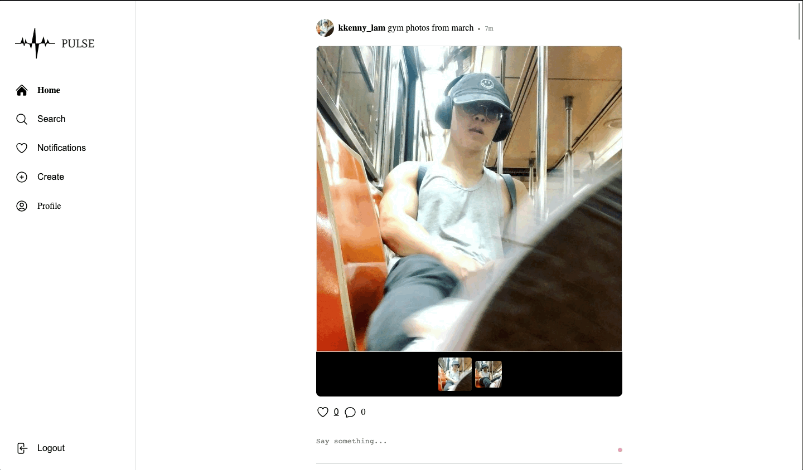
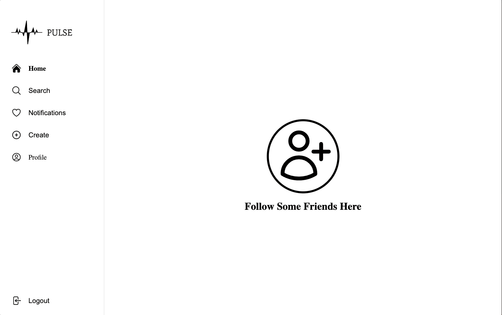
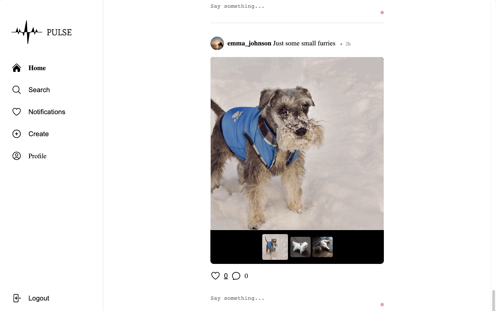

<p align="center">
    
</p>

## Overview

Pulse is a robust social media application crafted using the advanced MERN stack. It offers a seamless user experience,
allowing users to effortlessly register and update their profiles, create, edit, and delete posts, share their thoughts
by commenting on other posts, show appreciation by liking posts, and keep up with their favorite users by following them.

## Technology

- 
- 
- 
- 
- 
- 
- 
- 

## Features

- Responsive Design
<p align="center">
    
</p>

- Register & Edit Profile
<p align="center">
    
</p>
<p align="center">
    
</p>

- Create & Edit Post
<p align="center">
    
</p>
<p align="center">
    
</p>

- Like & Comment on Post
<p align="center">
    
</p>

- Follow Users
<p align="center">
    
</p>

- Notifications
<p align="center">
    
</p>

## Getting Started

### Prerequisites

- yarn/npm
- Setup Google Cloud Console Credentials
- Sign up for MongoDB Atlas
  - Create a shared database

### Backend Installation

```sh
# Clone the repo
git clone https://github.com/klam2k20/Pulse.git

# Create .env
cd Pulse/backend
PORT=8080
CLIENT=http://localhost:5173
JWT_SECRET=<SECRET>
MONG0DB_URI=<MONGODBURI>

# Install dependencies
npm install

# Start the server
npm start
```

### Frontend Installation

```sh
cd ../frontend

# Install dependencies
npm install

# Start the application
npm run dev
```
